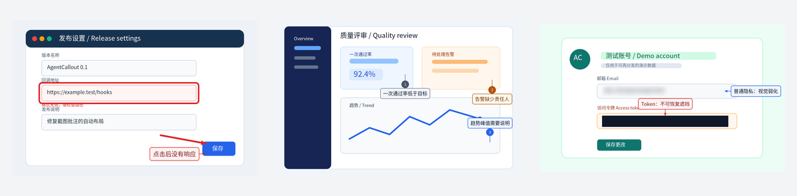
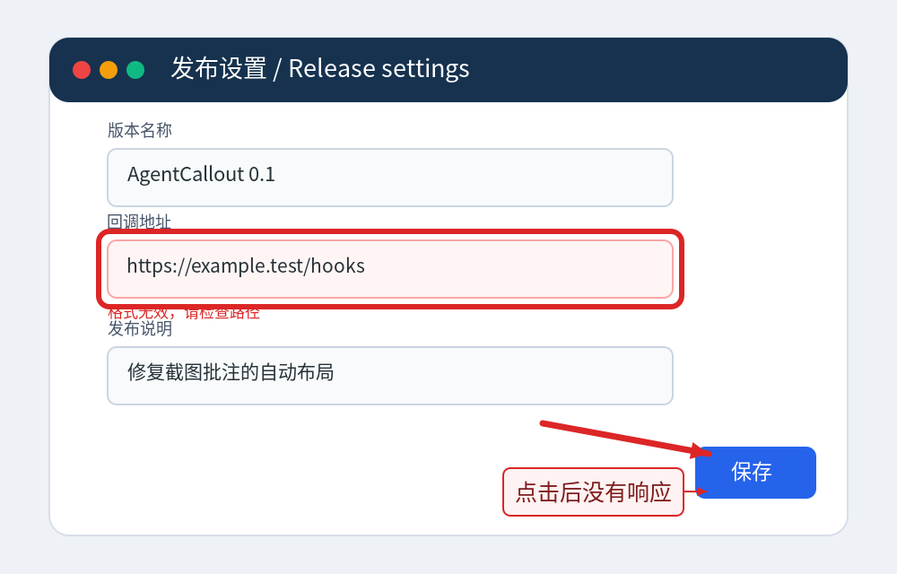
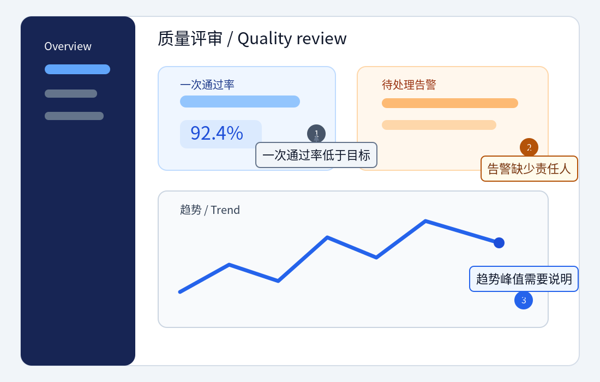
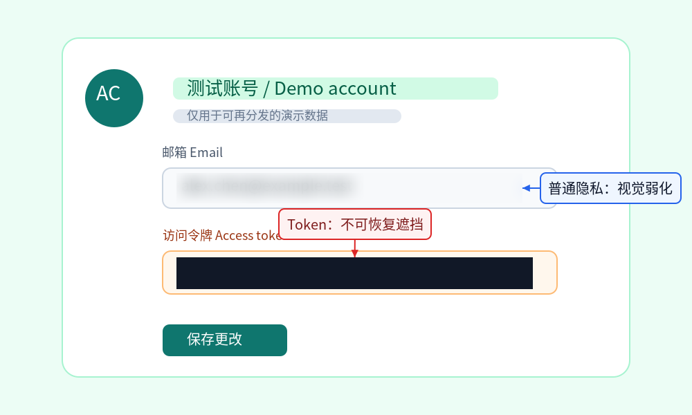

# AgentCallout · AI 截图批注笔

**让 Claude Code、Codex 和其他 AI Agent 用结构化参数批注已有截图，并输出可重放的 PNG + JSON。** _Give AI agents a pen for screenshots._



> [!IMPORTANT]
> Windows 上的源码 gate、GitHub CLI 安装、Claude Plugin、Codex 直接 MCP、真实 Agent 两轮批注、干净 clone、Node 20 和像素级 redact 均已验证。尚未完成的是 macOS/Linux。详见[兼容性与证据边界](docs/compatibility.md)。

## 为什么 Agent 需要它

普通绘图库能画线，却没有告诉 Agent 如何检查截图、描述目标、避开遮挡、查看结果再修正。AgentCallout 把这条链路做成一个本地能力层：

- 用版本化 `AnnotationSpec` 描述矩形、椭圆、箭头、文字、callout、编号、高亮、聚光灯、模糊和安全遮挡；
- 同时支持精确像素坐标和可跨分辨率重放的 `0..1` 归一化坐标；
- 自动给 callout 选择上、右、下、左位置，尽量避开目标和既有文字框，并返回无法避免的 warning；
- 输出 PNG、JSON sidecar、输入/spec/输出 SHA-256、渲染器与字体版本、绝对路径和 Markdown 引用；
- 完全本地渲染，不需要 OpenAI、Anthropic 或其他模型 API Key。

AgentCallout 处理**已有 PNG、JPEG、WebP 截图**。它不是系统截图工具、桌面 GUI 或视频编辑器。

## 架构

```text
Claude Code / Codex
        │
        ├── Agent Skill：检查 → 裁剪 → 验证 → 批注 → 查看 → 修正
        │
        └── 本地 stdio MCP ─┐
                            ├── 共享 TypeScript core
CLI ────────────────────────┘        │
                                     ├── AnnotationSpec v1 + 像素解析
                                     ├── 确定性 callout 排版
                                     └── Sharp/libvips + 受控 SVG + Noto Sans CJK SC
                                                        │
                                                        └── PNG + JSON sidecar
```

CLI、MCP 和两种插件使用同一个内核；Skill 只负责教 Agent 完成视觉检查闭环，不复制渲染逻辑。输出固定重新编码为 PNG，并在返回前重新解码检查。

## 前置条件

- Node.js `>=20.10.0`；Node `20.10.0` doctor、Node `20.19.5` 全 gate 和当前 Node `24.18.1` 均已验证。
- npm；插件首次准备 Sharp 原生运行时时需要访问 npm registry。
- 使用 GitHub 安装时需要 Git 和可访问的 GitHub HTTPS 网络。
- Claude Code 或 Codex 仅在采用对应插件安装方式时需要。

Windows 是首要目标；macOS 和 Linux 尚未完成项目级运行验证。

## 安装到 Claude Code

状态：**VERIFIED（Windows / Claude Code 2.1.251）**。GitHub Marketplace add、Plugin install/update、Skill/MCP 发现、doctor、inspect 和两次批注预览均已真实执行；最终版本卸载/重装在发布收尾记录。

```powershell
claude plugin marketplace add https://github.com/xxf66666/AgentCallout.git
```

```powershell
claude plugin install agent-callout@agent-callout
```

若安装后未立即发现 Skill/MCP，最多重启 Claude Code 一次，然后让 Agent 调用 `doctor`。

更新：

```powershell
claude plugin marketplace update agent-callout; claude plugin update agent-callout@agent-callout
```

卸载插件并移除 Marketplace 来源：

```powershell
claude plugin uninstall agent-callout@agent-callout; claude plugin marketplace remove agent-callout
```

## 安装到 Codex

Codex `0.151.0` 的主安装方式是 GitHub CLI 包 + 官方 MCP 注册，共两条命令。显式 `--install-links=true` 可覆盖某些 npm 配置中的 `install-links=false`，避免 Git 包被链接到会清理的临时 clone。

```powershell
npm install --global --install-links=true git+https://github.com/xxf66666/AgentCallout.git
```

```powershell
codex mcp add agent-callout -- agent-callout mcp
```

开启一个新 Codex 会话，然后让 Agent 调用 `doctor`。`codex mcp get agent-callout --json` 可查看注册结果。

更新 CLI；既有 MCP 注册无需重复添加：

```powershell
npm install --global --install-links=true git+https://github.com/xxf66666/AgentCallout.git
```

Windows 更新前先结束正在使用 AgentCallout 的 Codex 会话，否则运行中的 Sharp DLL 可能被锁定；MCP 注册本身无需删除。

卸载能力：

```powershell
codex mcp remove agent-callout; npm uninstall --global agent-callout
```

仓库还提供可选的 **Skills-only Codex Plugin**，用于获得 `$agent-callout` 工作流提示；它不负责启动 MCP Server。先完成上面的两条主安装命令，再按需执行：

```powershell
codex plugin marketplace add xxf66666/AgentCallout; codex plugin add agent-callout@agent-callout
```

可选 Skill 的更新与卸载：

```powershell
codex plugin marketplace upgrade agent-callout
```

```powershell
codex plugin remove agent-callout@agent-callout; codex plugin marketplace remove agent-callout
```

## 首次使用为什么可能较慢

Claude Plugin 已携带构建后的 MCP Server、锁定版本的 package/lockfile 和中文字体，但 Sharp/libvips 包含平台相关原生运行时，不能伪装成单一 JavaScript 文件。

第一次启动 MCP 时，`bootstrap.mjs` 会检查插件目录中的 `node_modules/sharp/package.json`。如果缺失，它会在**插件自己的目录**运行锁定依赖的：

```powershell
npm ci --omit=dev --ignore-scripts --no-audit --no-fund
```

这一步需要 npm 网络访问，输出只写入 stderr，不上传截图，也不修改全局 Node/npm 配置。后续启动在 Sharp 已存在时直接跳过。代理、只读插件缓存、npm 不可用或首次启动超时都可能让 bootstrap 失败；排除网络/权限问题后可重试。Codex 主安装方式在全局 npm install 阶段完成同一原生依赖安装，不使用 Plugin bootstrap。

## 直接安装 CLI（GitHub fallback）

不使用 Agent 插件时，可直接从 GitHub 安装全局 CLI：

```powershell
npm install --global --install-links=true git+https://github.com/xxf66666/AgentCallout.git
```

无法全局安装时，使用显式 clone/build fallback：

```powershell
git clone https://github.com/xxf66666/AgentCallout.git; Set-Location .\AgentCallout; npm ci; npm run build; node .\dist\cli.js doctor --self-test --json
```

更新或卸载全局 CLI：

```powershell
npm install --global --install-links=true git+https://github.com/xxf66666/AgentCallout.git
```

```powershell
npm uninstall --global agent-callout
```

## Doctor 与 self-test

全局 CLI：

```powershell
agent-callout doctor --self-test --json
```

仓库 clone：

```powershell
node .\dist\cli.js doctor --self-test --json
```

`doctor` 检查 Node、Sharp、libvips、捆绑字体 hash 和中英文文字渲染。`--self-test` 还会在系统临时目录真实生成图片，重新解码 sidecar，并逐像素确认测试 redact 区域为不透明覆盖；临时目录随后删除。插件用户可让 Agent 调用 MCP 的 `doctor` 工具，后者执行不写文件的核心健康检查。

## CLI

Agent 自动化建议加 `--json`，以取得路径、尺寸、hash、warning 和 renderer 信息。

```powershell
agent-callout inspect .\screenshot.png --json
```

```powershell
agent-callout validate .\screenshot.png --spec .\annotations.json --json
```

```powershell
agent-callout annotate .\screenshot.png --spec .\annotations.json --output .\screenshot.annotated.png --json
```

```powershell
agent-callout crop .\screenshot.png --rect 20,30,400,240 --output .\crop.png --json
```

```powershell
agent-callout contact-sheet .\a.png .\b.png --output .\contact-sheet.png --json
```

```powershell
agent-callout mcp --allow-root .
```

`--spec-json` 可替代 `--spec` 传入行内 JSON；`--coordinate-space normalized` 可用于 crop；路径不在当前目录时可重复添加 `--allow-root <path>`。默认拒绝覆盖现有输出，只有明确传入 `--overwrite` 才允许替换非输入目标。

## MCP tools

AgentCallout 提供六个本地 tool：

| Tool                       | 用途                                      | 主要结果                     |
| -------------------------- | ----------------------------------------- | ---------------------------- |
| `inspect_image`            | 检查真实格式、方向、尺寸、大小与 SHA-256  | 结构化结果 + JSON 文本       |
| `validate_annotation_spec` | 严格验证 v1 spec 并按图片尺寸解析坐标     | resolved spec、warning、hash |
| `annotate_image`           | 生成批注 PNG 与 sidecar                   | JSON 文本 + 受限 PNG 预览    |
| `crop_image`               | 截取局部区域供 Agent 放大检查             | JSON 文本 + 受限 PNG 预览    |
| `create_contact_sheet`     | 把多张图片组合为联系表                    | JSON 文本 + 受限 PNG 预览    |
| `doctor`                   | 检查运行时、Sharp/libvips、字体及文字渲染 | 结构化健康报告               |

图片工具始终把完整 PNG 写入本地，并在 JSON TextContent 中返回 `outputPath`、`sidecarPath`、`markdown`、尺寸、hash 和 warning。ImageContent 是不超过约 `128 KiB` 的预览，可能缩小，不代替完整输出文件。

为兼容 Codex `0.151.0` 的结构化结果优先行为，当前所有图片工具统一省略 `structuredContent`，避免宿主丢掉图片；纯结构化工具仍同时返回 `structuredContent` 和 JSON 文本。若客户端不显示 ImageContent，Agent 必须打开绝对 `outputPath`，或对结果再次调用 `crop_image`；**只拿到路径时不能声称已经看过图片**。远程宿主未必能访问本机路径，当前路径 fallback 只保证同机使用。详见 [MCP 结果兼容 ADR](docs/adr/0004-mcp-result-compatibility.md)。

## Agent Skill 工作流

安装后的理想闭环不是“一次盲画”，而是：

1. `inspect_image`：读取应用 EXIF 方向后的真实画布尺寸。
2. `crop_image`：目标太小或不确定时先局部放大，不猜坐标。
3. `validate_annotation_spec`：检查 schema、ID、坐标和越界 warning。
4. `annotate_image`：生成新的 PNG 与可重放 sidecar，不覆盖原图。
5. **查看结果**：检查箭头终点、中文/英文换行、目标遮挡、编号和 callout 碰撞。
6. **修正并重渲染**：保留稳定 ID，调整 target、位置、文字或 placement。
7. 最后返回 tool 给出的绝对路径和 Markdown 引用。

Skill 的完整指令在 [`plugins/agent-callout/skills/agent-callout/SKILL.md`](plugins/agent-callout/skills/agent-callout/SKILL.md)。

## AnnotationSpec v1.0

```json
{
  "version": "1.0",
  "coordinateSpace": "normalized",
  "annotations": [
    {
      "id": "save-button",
      "type": "rectangle",
      "rect": { "x": 0.72, "y": 0.74, "width": 0.2, "height": 0.12 },
      "style": { "strokeColor": "#E53935", "strokeWidth": 4 }
    },
    {
      "id": "save-note",
      "type": "callout",
      "target": { "x": 0.72, "y": 0.74, "width": 0.2, "height": 0.12 },
      "text": "点击后没有响应",
      "placement": "auto"
    }
  ]
}
```

- `version` 必须为 `"1.0"`；未知字段会被拒绝。
- 原点在左上角。根级 `coordinateSpace` 默认为 `pixel`，单条 annotation 可覆盖为 `pixel` 或 `normalized`。
- 归一化点位于 `0..1`；区域宽高也使用画布比例，解析后成为有限整数像素。
- 部分越界区域会裁到画布并返回 warning；完全在画布外或解析后为空会报错。
- `id` 可省略；解析器按 annotation 顺序确定性生成 `a1`、`a2`，并拒绝重复或不安全 ID。
- Annotation 顺序就是绘制顺序。相同 spec、输入、renderer/font 环境会产生可重放的结果与稳定 hash。

十种类型为：`rectangle`、`ellipse`、`arrow`、`text`、`callout`、`numbered-callout`、`highlight`、`spotlight`、`blur`、`redact`。完整字段、样式范围、默认值、坐标舍入和 canonical JSON 语义见 [AnnotationSpec v1.0 规范](docs/annotation-spec.md)。

## Blur 不等于 Redact

- `blur` 只是视觉弱化，统计特征和轮廓仍可能被推断或增强。它适合普通隐私的降噪展示，**不能**用于 Token、密码、私钥或必须不可恢复的信息。
- `redact` 用严格的 `#RRGGBB` 颜色对目标像素执行完全不透明替换。当前自动化测试会重新解码输出并确认 redact 区域不再保留原像素。

Redact 只能保护坐标准确覆盖的区域；Agent 仍必须查看输出，确认没有漏选、偏移或在后续文字中重新泄露秘密。

## 可再分发示例

三组截图均为项目脚本生成的模拟 UI，不包含真实账号、Token 或用户数据。每组都提供原图、spec、输出 PNG、sidecar 和实际命令。

### 1. UI bug

红框标出无效字段，箭头指向保存按钮，并添加中文说明。



[原图](examples/ui-bug/input.png) · [AnnotationSpec](examples/ui-bug/annotations.json) · [sidecar](examples/ui-bug/output.json)

```powershell
node dist/cli.js annotate examples/ui-bug/input.png --spec examples/ui-bug/annotations.json --output examples/ui-bug/output.png --allow-root . --overwrite
```

### 2. Numbered review

用 1、2、3 标出三项评审问题，并使用确定性 callout 排版。



[原图](examples/numbered-review/input.png) · [AnnotationSpec](examples/numbered-review/annotations.json) · [sidecar](examples/numbered-review/output.json)

```powershell
node dist/cli.js annotate examples/numbered-review/input.png --spec examples/numbered-review/annotations.json --output examples/numbered-review/output.png --allow-root . --overwrite
```

### 3. Privacy

普通邮箱使用 blur，模拟 Token 使用真实 opaque redact。



[原图](examples/privacy/input.png) · [AnnotationSpec](examples/privacy/annotations.json) · [sidecar](examples/privacy/output.json)

```powershell
node dist/cli.js annotate examples/privacy/input.png --spec examples/privacy/annotations.json --output examples/privacy/output.png --allow-root . --overwrite
```

重新生成全部示例与联系表：

```powershell
npm run examples
```

## 当前兼容性

状态含义和完整证据日志见 [`docs/compatibility.md`](docs/compatibility.md)。`VERIFIED` 只覆盖表中明确写出的范围，不外推到 GitHub/客户端安装。

| 范围                                   | 状态                                              | 当前证据边界                                                                           |
| -------------------------------------- | ------------------------------------------------- | -------------------------------------------------------------------------------------- |
| Windows 11 + Node 24.18 当前工作树     | [PARTIALLY VERIFIED](docs/compatibility.md)       | lint、typecheck、52/52 tests、临时可复现 build 对比通过；尚非 clean clone              |
| CLI core/doctor/self-test              | [VERIFIED](docs/compatibility.md)                 | GitHub 全局安装、doctor/self-test、sidecar 解码和 redact 像素自检通过                  |
| stdio MCP 与真实 Agent                 | [VERIFIED](docs/compatibility.md)                 | 六个 tools；Claude/Codex doctor、inspect、两次 annotate 和模型可见预览通过             |
| 三组模拟示例                           | [VERIFIED（本地生成范围）](docs/compatibility.md) | 项目自身生成 PNG/sidecar，重复渲染确定性检查通过                                       |
| Claude Code Marketplace 安装与真实调用 | [VERIFIED](docs/compatibility.md)                 | GitHub install/update、Skill/MCP 发现、两次图片预览和视觉评价通过；最终卸载/重装待收尾 |
| Codex GitHub CLI + 直接 MCP            | [VERIFIED](docs/compatibility.md)                 | 两命令安装、真实 doctor/inspect/validate/两次 annotate 和两个模型可见预览通过          |
| Node 20.10 / 20.19                     | [VERIFIED](docs/compatibility.md)                 | 20.10 doctor；20.19 的 52 tests、typecheck、build、dist 复现和 self-test 通过          |
| macOS、Linux                           | [NOT VERIFIED](docs/compatibility.md)             | 目标支持范围，尚无项目级运行证据                                                       |

当前本机事实：Sharp `0.35.4`、libvips `8.18.6`、Noto Sans CJK SC `2.004`；GitHub clean clone 和 Node 20.19 全 gate 通过，`npm run check:dist` 逐字节比较了 3 个 dist 文件。非 Windows 平台仍不在这些证据内。

## 安全与限制

- 默认本地运行、无遥测、渲染时不联网；安装/bootstrap 的 GitHub/npm 下载是单独的显式网络边界。
- 默认单个输入最大 `50 MiB`、解码后最大 `40,000,000` 像素；拒绝动画或多页输入。
- MCP 图片预览约束为 `128 KiB`，完整 PNG 保留在本地路径。
- 输入/输出必须位于允许根目录。CLI 默认当前目录和系统临时目录；MCP 还合并客户端声明的 `file://` workspace roots。
- 默认不覆盖已有 PNG 或 sidecar，也拒绝把输入路径、符号链接或硬链接别名作为输出；只有直接 CLI 可显式使用 `--overwrite` 替换非输入目标，MCP 工具不提供覆盖参数。
- 输出应用 EXIF orientation、转换为 sRGB PNG、移除非必要 metadata，并重新解码确认尺寸。
- 用户文字会转义为纯文本；用户不能注入 SVG、Pango markup、CSS、URL 或外部资源。
- Sidecar 含批注文字、hash 和文件关联信息，应作为敏感交付物管理。分享 PNG 不等于应同时公开 sidecar。
- AgentCallout 本身不上传截图，但 Claude Code、Codex 或其他宿主可能按其隐私设置把 ImageContent 发送给模型服务。

完整威胁模型与剩余风险见 [`docs/security.md`](docs/security.md)。

## 已知限制

- Windows 更新全局 Codex CLI 前应关闭正在使用 AgentCallout 的 Codex 会话；运行中的 Sharp DLL 会阻止 npm 原子替换。
- Claude Plugin 首次准备依赖、Codex GitHub 全局安装都需要 npm 网络；当前没有离线单文件可执行程序。
- 自动排版是确定性启发式，不是全局最优。warning 表示必须视觉复核，不能静默忽略。
- `validate_annotation_spec` 验证 schema 与坐标；极端长文字是否能在具体画布中排下，要到渲染阶段才能完全确定。
- ImageContent 是受控预览，可能缩小；远程宿主不能假设可读取本机绝对路径。
- MVP 不含 OCR、DOM selector 定位、系统截图快捷键、GUI、录屏或视频。
- 输入限单帧 PNG/JPEG/WebP，输出固定 PNG；非 Windows 平台仍待验证。
- 安全 redact 依赖 Agent 选对区域；项目不会自动发现截图中的秘密。

## 路线图

下一阶段优先做可选的本地 OCR/Playwright 定位 adapter，让 Agent 更可靠地产生 bbox，同时继续复用同一个 AnnotationSpec 和 renderer；随后改进密集 callout 全局布局与更多宿主回归。系统截图入口、轻量 GUI 和视频编辑属于 Later，不进入 MVP。详见 [`docs/roadmap.md`](docs/roadmap.md)。

## 本地开发验证

```powershell
npm ci; npm run lint; npm run typecheck; npm test; npm run build; npm run check:dist; npm run smoke:mcp; node .\dist\cli.js doctor --self-test --json
```

截至 2026-08-30，当前 Windows 工作树最近一次独立检查结果：lint 通过、typecheck 通过、Vitest `52/52` 通过、临时构建与 3 个 dist 文件逐字节一致、CLI self-test 的 redact 像素验证通过；Claude/Codex 均完成真实两轮批注和预览查看。这仍不是 clean clone 或非 Windows 证明。

## License 与字体

AgentCallout 源码使用 [MIT License](LICENSE)。捆绑的 `NotoSansCJKsc-Regular.otf` 来自 Noto CJK，使用 [SIL Open Font License 1.1](assets/fonts/OFL.txt)。字体 SHA-256：

```text
2c76254f6fc379fddfce0a7e84fb5385bb135d3e399294f6eeb6680d0365b74b
```

来源、版权和再分发说明见 [`NOTICE`](NOTICE)。
