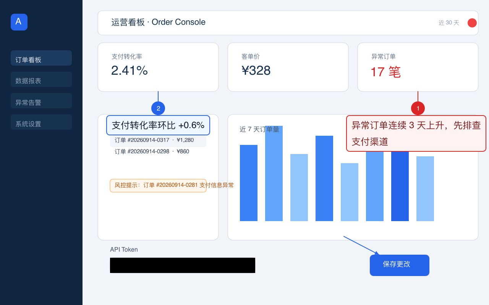

# AgentCallout · AI 截图批注笔

[](https://github.com/xxf66666/AgentCallout/actions/workflows/ci.yml)

**你说出哪里有问题，AI 负责把它标清楚——然后亲眼检查，不满意就自己改。**



<p align="center"><sub>上图由 AgentCallout 一次生成：编号说明框、指向箭头，以及对 API Token 的不可恢复遮挡。</sub></p>

它在本机处理 PNG、JPEG、WebP——不上传截图、不需要任何模型 API Key。给 Claude Code 或 Codex 装上它，你说清楚想标哪里，剩下的交给流程：

```text
检查原图 → 渲染批注 → AI 亲眼查看预览 → 发现有遮挡/偏移 → 自动修正
```

## 三个不一样

- **每一步都有证据**：定位候选绑定原图/截图 SHA-256，预览附像素指标，修订是 append-only 的 `.revN` 链——AI 声称"看过了、没遮挡"时，是可以核对的；
- **本地优先**：截图不出机器、不需要模型 API Key；OCR 与浏览器定位是可选运行时，零下载复用本机引擎；
- **为跨 AI 交接而生**：批注是"压平 PNG + 普通 JSON"两条腿走路，另一个 AI 不装 AgentCallout 也能读，装了就能校验、重渲染、继续修订。

| 能力                 | 入口                              | 一句话                                                        |
| -------------------- | --------------------------------- | ------------------------------------------------------------- |
| 十类批注             | `annotate`                        | 矩形/椭圆/箭头/文字/说明框/编号/高亮/聚光灯/模糊/安全遮挡     |
| 增量修订             | `revise`                          | 稳定 ID 修改生成 `.revN`，历史可回放                          |
| 批量批注             | `annotate --batch`                | 一套截图一次标完，编号跨图连续                                |
| 文字定位（可选）     | `locate-text`                     | 本地 OCR 中英文候选 + 置信度，绑定原图 hash                   |
| 网页元素定位（可选） | `locate-dom`                      | 本机 Chrome/Edge 按 selector/文字/可访问性名称，绑定截图 hash |
| 候选确认             | `preview-candidates`              | 候选画成编号框，看图选号不猜坐标                              |
| 跨 AI 交接           | `create-handoff`                  | 普通目录：PNG + JSON + manifest + 摘要 + 入口                 |
| 协作分叉             | `fork-lineage` / `diff-revisions` | 显式分叉 + 稳定 ID 级差异对比                                 |

它只负责**批注已有截图**——不做系统截图、录屏、视频编辑或桌面 GUI。

## 快速上手

需要 Node.js `>=22`、Git，并能访问 GitHub 和 npm。

**只用 Claude Code**（两行）：

```powershell
claude plugin marketplace add https://github.com/xxf66666/AgentCallout.git
claude plugin install agent-callout@agent-callout
```

**只用 Codex**（两行）：

```powershell
npm install -g --install-links=true git+https://github.com/xxf66666/AgentCallout.git
codex mcp add agent-callout -- agent-callout mcp
```

装好后新开一个会话，说：

```text
调用 AgentCallout doctor，告诉我是否正常。
```

> **以 doctor 通过为准。** 配置存在不代表安装完整；首次启动可能需要下载 Sharp 图片运行库，稍慢属正常。

## 怎么用

直接对 Claude Code 或 Codex 说：

```text
把这张截图中的保存按钮用红框标出来，用箭头指向它，
添加文字“点击后没有响应”，生成批注图片并给我 Markdown。
```

Agent 会先检查图片、必要时放大局部，然后生成批注并**自己查看结果**——有遮挡或偏移就重新调整。假设原图是 `screenshot.png`，默认产出：

- `screenshot.annotated.png`：最终批注图片（原图不会被覆盖）；
- `screenshot.annotated.json`：可再次修改、重渲染的批注记录（普通 JSON）；
- Markdown 图片引用：可直接放进报告或文档。

继续修改时生成 `.rev1`、`.rev2` 等新版本，历史全部保留。工具每次最多返回一张 512 px / 64 KiB 的预览；修订、预览与异常处理的完整规则见[接口文档](docs/annotation-spec.md#revising-a-committed-annotation)。

### 一次标完整套截图

```json
{
  "numbering": "continuous",
  "items": [
    {
      "input": "step1.png",
      "spec": {
        "version": "1.1",
        "annotations": [
          {
            "id": "issue",
            "type": "numbered-callout",
            "target": { "x": 120, "y": 268, "width": 630, "height": 64 },
            "text": "回调地址格式错误"
          }
        ]
      }
    },
    { "input": "step2.png", "specPath": "step2.spec.json" }
  ]
}
```

```powershell
agent-callout annotate --batch .\batch.json --json
```

`numbering: "continuous"` 让所有编号批注跨图连续 1..N；逐图顺序执行、单图失败隔离，默认 fail-fast，`--continue-batch` 跳过失败图继续。

### 让 AI 看得见候选再确认

OCR/DOM 定位可能返回多个候选或低置信度结果——这时**必须看图确认，不能猜坐标**：

```powershell
agent-callout preview-candidates .\page.png --candidates .\locate-result.json --json
```

候选会被画成源图上的编号描边框：看图选号，再对选中的候选批注。

## 按文字与网页元素定位（可选能力）

两项定位能力默认**不安装**运行时，需要时显式安装、离线或本机执行：

|      | 按文字定位（OCR）                             | 网页元素定位（DOM）                                  |
| ---- | --------------------------------------------- | ---------------------------------------------------- |
| 安装 | `agent-callout ocr install`                   | `agent-callout browser install`                      |
| 定位 | `locate-text 图.png --query "保存"`           | `locate-dom URL --text "提交" --screenshot page.png` |
| 引擎 | Tesseract.js + 本地中英文模型，断网子进程执行 | playwright-core + 本机 Chrome/Edge（零下载）         |
| 证据 | 候选绑定原图 hash 与置信度                    | 候选绑定截图 SHA-256 与页面状态                      |

两者都只返回候选 bbox 与证据——**多候选或低置信度必须先查看确认**，`not-found` 不代表文字/元素不存在，定位结果不会自动变成批注。详见 [OCR 文档](docs/ocr.md)与[DOM 文档](docs/dom.md)。

## 把结果交给另一个 AI（或多 AI 协作）

**交接包**：一条命令把批注 PNG、完整 JSON、manifest（逐文件 SHA-256）、安全摘要和 Markdown 入口打进一个普通目录。接收方不装 AgentCallout 也能读；装了可以校验、重渲染、继续修订：

```powershell
agent-callout create-handoff .\screenshot.annotated.json --json
agent-callout verify-handoff .\screenshot.annotated.handoff --json
```

**多 AI 协作**：`fork-lineage` 把整个修订分叉给协作者（记录 fork.json），`diff-revisions` 按稳定 ID 对比双方差异——分叉后各自 revise，随时看清分歧。详见[协作文档](docs/lineage.md)。

手工交付时至少同时给两份文件：`*.annotated.png`（给人看）+ 同名 `*.annotated.json`（机器可读批注语义）。仅凭压平 PNG 无法还原批注层。

## 模糊和安全遮挡不是一回事

- `blur`：只是视觉弱化，**不能保证无法恢复**；
- `redact`：完全不透明的纯色替换，适合 Token、密码、私钥。

有安全要求时用 `redact`。涉及移除隐私遮挡的修订不会自动返回图片。

## 示例

所有示例都是项目生成的模拟界面，不含真实账号或 Token。

| 示例     | 内容                          | 文件                                       |
| -------- | ----------------------------- | ------------------------------------------ |
| UI bug   | 红框、箭头、中文说明          | [查看](examples/ui-bug/README.md)          |
| 编号评审 | 用 1、2、3 标出三个问题       | [查看](examples/numbered-review/README.md) |
| 隐私保护 | 邮箱模糊、模拟 Token 安全遮挡 | [查看](examples/privacy/README.md)         |

## 需要时再看

<details>
<summary><strong>更新或卸载</strong></summary>

### Claude Code

```powershell
claude plugin marketplace update agent-callout
claude plugin update agent-callout@agent-callout
# 更新后新开会话，再运行 doctor

claude plugin uninstall agent-callout@agent-callout
claude plugin marketplace remove agent-callout
```

### Codex

重装或更新前先关闭正在使用 AgentCallout 的 Codex 会话（Windows 上 Sharp DLL 可能被占用）：

```powershell
codex mcp remove agent-callout
npm install -g --install-links=true git+https://github.com/xxf66666/AgentCallout.git
codex mcp add agent-callout -- agent-callout mcp
agent-callout --version
```

</details>

<details>
<summary><strong>命令行（CLI）全表</strong></summary>

```powershell
agent-callout doctor --self-test --json                        # 环境自检
agent-callout inspect .\screenshot.png --json                  # 图片尺寸/格式/哈希
agent-callout annotate .\s.png --spec .\spec.json --json       # 单图批注
agent-callout annotate --batch .\batch.json --json             # 批量批注
agent-callout revise .\s.annotated.json --edits .\edits.json   # 增量修订
agent-callout inspect-sidecar .\s.annotated.json --json        # 安全摘要
agent-callout crop .\s.png --rect 100,100,400,200              # 局部放大
agent-callout locate-text .\s.png --query "保存" --json        # OCR 定位
agent-callout locate-dom URL --text "提交" --screenshot p.png  # DOM 定位
agent-callout preview-candidates .\p.png --candidates .\r.json # 候选编号预览
agent-callout create-handoff .\s.annotated.json --json         # 交接包
agent-callout verify-handoff .\s.annotated.handoff --json      # 交接包校验
agent-callout fork-lineage .\s.annotated.json .\copy --json    # 分叉副本
agent-callout diff-revisions a.json b.json --json              # 修订对比
agent-callout ocr install | status                             # OCR 运行时
agent-callout browser install | status                         # 浏览器运行时
```

`edits.json` 使用 `add`、`set`、`remove`；`set` 表示完整替换同一 ID。[字段与修订规则](docs/annotation-spec.md#revising-a-committed-annotation)。

</details>

<details>
<summary><strong>给开发者：MCP、Skill 与 AnnotationSpec</strong></summary>

MCP 提供 16 个工具：

- `doctor`：检查运行环境。
- `inspect_image`：读取图片尺寸、格式和哈希。
- `validate_annotation_spec`：检查批注参数和坐标。
- `annotate_image`：生成批注图和预览。
- `revise_annotation`：从已验证 sidecar 按稳定 ID 创建下一版本。
- `crop_image` / `create_contact_sheet`：局部放大 / 多图联系表。
- `inspect_annotation_sidecar`：路径与文字脱敏的紧凑完整性摘要。
- `locate_text` / `locate_dom` / `preview_candidates`：OCR 与 DOM 定位、候选编号预览。
- `annotate_batch`：多图批量批注与聚合预览。
- `create_handoff` / `verify_handoff`：跨 AI 交接包与校验。
- `fork_lineage` / `diff_revisions`：分叉副本与修订对比。

新建批注使用 AnnotationSpec 1.1（可读 preset、语义 tone、密集布局）；1.0 sidecar 永远原样重放。完整字段见 [AnnotationSpec 1.0 和 1.1](docs/annotation-spec.md)。

可选 Codex Skill（教 Agent 按流程工作，不替代 MCP 安装）：

```powershell
codex plugin marketplace add xxf66666/AgentCallout
codex plugin add agent-callout@agent-callout
```

> Codex CLI 0.151 在部分 Windows 机器上把 Git Marketplace clone 固定限制为 30 秒；此可选 Skill 更新失败时继续使用已验证的全局 CLI+MCP 主路径。

</details>

## 兼容性与限制

| 环境                | 状态                                            |
| ------------------- | ----------------------------------------------- |
| Windows 11          | 已实测（0.2.x 开发平台与 0.3.0 OCR 测试）       |
| macOS 26 arm64      | 已实测（0.3.0–0.7.0 发布验收平台）              |
| Linux               | CI 矩阵守护；发布级人工验收待 Linux 行程        |
| Node.js 22、24      | CI 矩阵全绿（支持线 v0.5.0 起为 >=22）          |
| Claude Code 2.1.270 | Plugin 0.7.0（OCR 定位、批量、交接、fork/diff） |
| Codex CLI 0.154.0   | MCP 0.7.0（同上，含真实批量与 fork/diff 验收）  |

自动避让只保护传入的目标区域；**warning 为空不代表未标注的源内容没有遮挡**，仍需视觉复核。输入上限：单图 ≤50 MB 且 ≤4000 万像素。版本历史与逐版证据见[兼容性记录](docs/compatibility.md)与[发布记录](docs/releases/)。

## 详细文档

[批注字段与坐标](docs/annotation-spec.md) · [本地 OCR](docs/ocr.md) · [网页元素定位](docs/dom.md) · [交接包](docs/handoff.md) · [协作与 fork](docs/lineage.md) · [安装实测记录](docs/compatibility.md) · [安全说明](docs/security.md) · [故障恢复 Runbook](docs/runbooks.md) · [架构决策](docs/decisions.md) · [路线图](docs/roadmap.md)

## License

AgentCallout 使用 [MIT License](LICENSE)。捆绑的 Noto Sans CJK SC 字体使用 [SIL Open Font License 1.1](assets/fonts/OFL.txt)，详情见 [NOTICE](NOTICE)。
